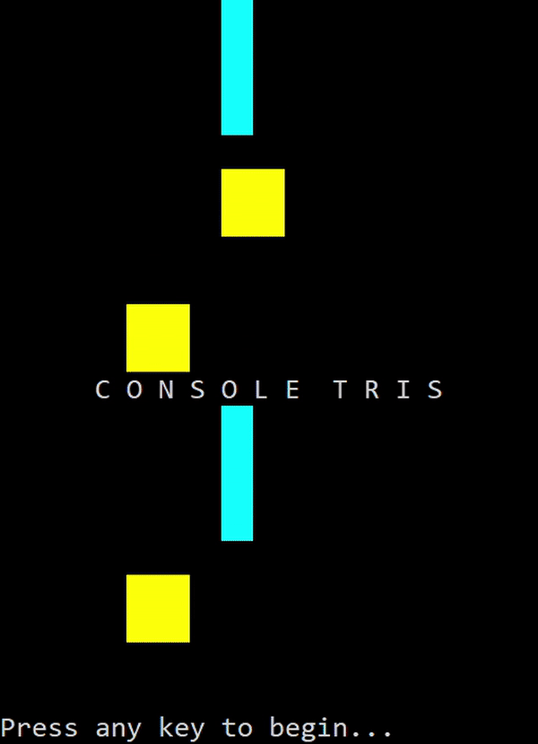

<!-- TABLE OF CONTENTS -->
<details>
  <summary>Table of Contents</summary>
  <ol>
    <li>
      <a href="#about-the-project">About The Project</a>
      <ul>
        <li><a href="#features">Features</a></li>
      </ul>
    </li>
    <li>
      <a href="#getting-started">Getting Started</a>
      <ul>
        <li><a href="#prerequisites">Prerequisites</a></li>
        <li><a href="#building">Building</a></li>
      </ul>
    </li>
    <li><a href="#contributing">Contributing</a></li>
    <li><a href="#license">License</a></li>
  </ol>
</details>


<!-- ABOUT THE PROJECT -->
## About The Project

ConsoleTris is a fully-functional Tetris clone that runs entirely within the windows shell.



### Features
 - Ability to clear rows
 - Ability to hold a piece
 - Score-keeping
 - Ability to rotate pieces (including ability to T-Spin)
 - Colored pieces
 - FPS monitoring
 - Music
 - Animated start screen

<!-- GETTING STARTED -->
## Getting Started

### Prerequisites

To build ConsoleTris, a local copy of the repository as well as the .NET Core 6 SDK are required.

### Building

1. Clone the repo
   ```sh
   git clone https://github.com/thebluearchive/ConsoleTris
   ```
2. Navigate to the `src\ConsoleTris\` directory and build the repo
   ```sh
   dotnet build ConsoleTris
   ```

<!-- CONTRIBUTING -->
## Contributing

Any contributions to this project are welcome and **greatly appreciated**.

If you have a suggestion that would make this better, please fork the repo and create a pull request. You can also simply open an issue with the tag "enhancement".

1. Fork the Project
2. Create your Feature Branch (`git checkout -b feature/AmazingFeature`)
3. Commit your Changes (`git commit -m 'Add some AmazingFeature'`)
4. Push to the Branch (`git push origin feature/AmazingFeature`)
5. Open a Pull Request

<!-- LICENSE -->
## License

Distributed under the MIT License. See `LICENSE.txt` for more information.
